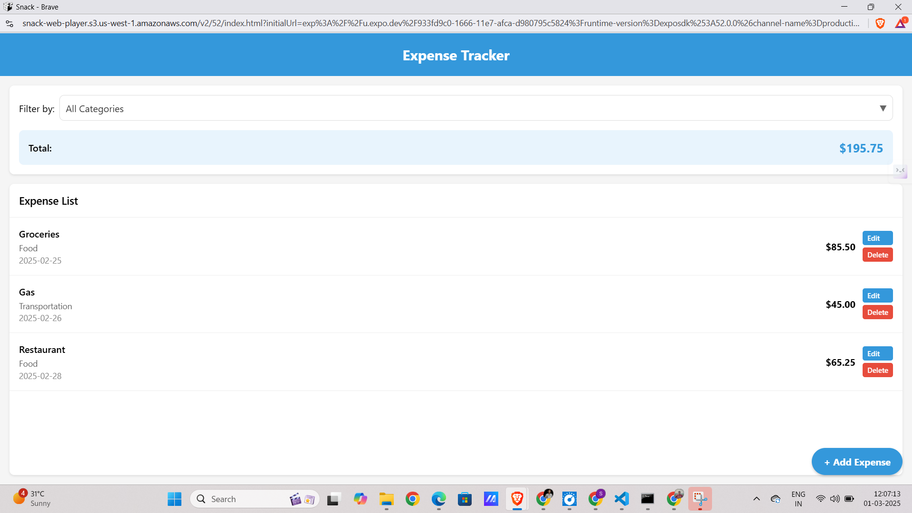
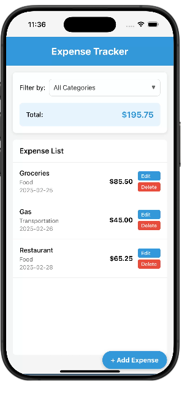
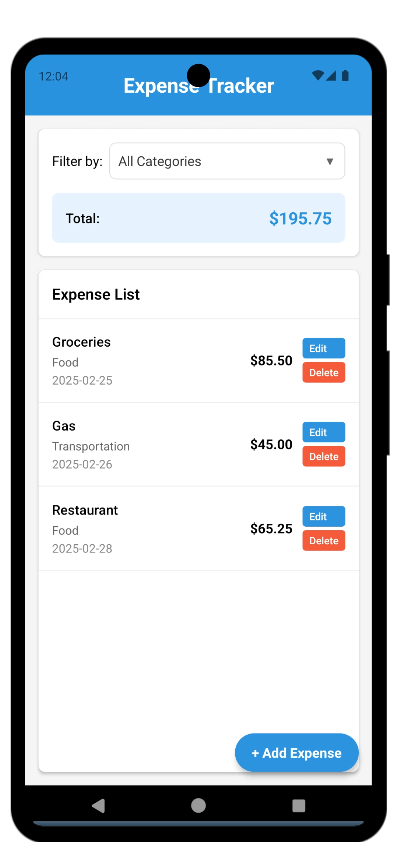

# Expense Tracker App

This is an **Expense Tracker** application built using **React Native** and **Expo**. The app allows users to track their expenses on both iOS and Android devices seamlessly.

## Screenshots

### Desktop View



### iOS View



### Android View



## Features

- Track daily expenses
- View expenses in a categorized format
- Responsive design for iOS and Android
- Simple and intuitive user interface

## Installation & Setup

### Prerequisites

Ensure you have the following installed:

- **Expo CLI**
- **Git**
- **Visual Studio Code**

### Step 1: Download the Project

If you worked on **Snack IDE** and downloaded the ZIP file, follow these steps:

1. Extract the ZIP file.
2. Open the extracted folder in **Visual Studio Code**.

### Step 2: Install Dependencies

Open the terminal in VS Code and run:

```bash
npm install  # or yarn install
```

### Step 3: Install Expo CLI

If you haven’t installed Expo CLI globally, run:

```bash
npm install -g expo-cli
```

### Step 4: Start the Expo Development Server

```bash
npx expo start  # or npm start
```

### Step 5: Run the App

You can now run the app using one of the following options:

#### On Physical Device:

1. Download the **Expo Go** app from the App Store (iOS) or Play Store (Android).
2. Scan the QR code displayed in the terminal or Expo DevTools using the Expo Go app.

#### On Emulator/Simulator:

Since you worked on **Snack IDE**, you may not have Android Studio or Xcode installed. Instead, use the Expo Go app on your mobile device to test the app.

## Building the App for Production

To generate a standalone build for Android and iOS, run:

### Android Build

```bash
npx expo build:android
```

### iOS Build (Mac only)

```bash
npx expo build:ios
```

## Contributing

Feel free to contribute by submitting a pull request.
